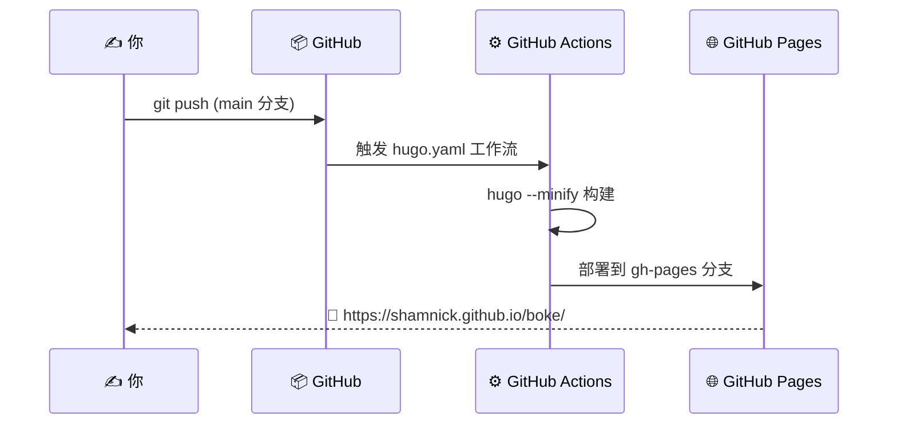

<p align="center">
  
</p>

<p align="center">
  <b>个人技术博客 · Hugo × GitHub Pages · 记录思考，分享技术</b>
</p>

<p align="center">
  <a href="https://shamnick.github.io/boke/">
    
  </a>
  <a href="https://github.com/Shamnick/boke/blob/main/LICENSE">
    
  </a>
  <a href="https://gohugo.io/">
    
  </a>
  <a href="https://github.com/Shamnick/boke/actions">
    
  </a>
</p>

---

## 📖 关于本站

> **"小小人间不慌张"** —— 在这个信息爆炸的时代，保持节奏，持续输出。

这是一个面向 **AI 开发者 & 技术热爱者** 的个人博客，内容涵盖：

| 领域 | 内容方向 |
|------|---------|
| 🤖 **AI / Agent** | 多 Agent 系统、LLM 应用、AI 工程化实践 |
| 🛠️ **开发工具** | Hermes Agent、GitHub Actions、CI/CD 流水线 |
| 📐 **架构设计** | 系统设计、工作流编排、Kanban Swarm 等 |
| 💡 **技术随笔** | 开发心得、效率工具、最佳实践 |

---

## 🚀 最新文章

<!-- LATEST_POSTS_START -->
| # | 文章 | 日期 | 标签 |
|---|------|------|------|
| 1 | [别再写胶水代码了：Hermes Agent Kanban Swarm 如何用一张看板编排多 Agent 协奏曲](./content/posts/hermes-agent-kanban-swarm.md) | 2026-07-02 | `Hermes Agent` `Kanban` `多Agent协作` `AI开发` |
<!-- LATEST_POSTS_END -->

> 💡 *更多文章持续更新中...*

---

## 🏗️ 技术栈


| 组件 | 用途 | 备注 |
|------|------|------|
| ✍️ **Markdown** | 写作语言 | 纯文本专注内容，Git 友好 |
| ⚡ **Hugo** | 静态站点生成器 | 极速构建，丰富模板 |
| 🌐 **GitHub Pages** | 免费托管 | 全球 CDN，自动 HTTPS |
| 🔗 **GitHub Actions** | CI/CD | main 分支推送自动构建部署 |

---

## 📁 目录结构

```
📦 boke/
├── 📂 archetypes/         # 📋 文章模板（新建文章的脚手架）
│   └── default.md
├── 📂 content/
│   └── 📂 posts/          # 📝 **文章目录（写在这！）**
│       ├── hermes-agent-kanban-swarm.md
│       └── hello-world.md
├── 📂 layouts/            # 🎨 主题模板（可自定义样式）
│   ├── _default/
│   └── partials/
├── 📂 static/             # 🖼️ 静态资源（图片、CSS、JS）
├── 📂 .github/
│   └── workflows/         # ⚙️ CI/CD 自动部署流水线
├── 📄 config.toml         # ⚙️ Hugo 全局配置
├── 📄 README.md           # 📖 本文件
└── 📄 .gitignore
```

---

## ✍️ 如何写一篇新文章

### 方式一：Hugo 命令（推荐）

```bash
hugo new content/posts/my-new-post.md
```

会自动生成带 frontmatter 模板的文件。

### 方式二：手动创建

在 `content/posts/` 下新建 `.md` 文件，**frontmatter 格式**：

```yaml
---
title: "文章标题"
date: 2026-07-01
tags: ["标签1", "标签2"]
author: "Shamnick"
---
```

### 方式三：AI 自动写作 🤖

本博客已集成 **Hermes Agent Kanban Swarm** 多 Agent 协作流水线：

```bash
# 一行命令启动 AI 写作流水线
hermes kanban swarm "写一篇关于X的深度文章" \
  --worker "researcher:调研X架构" \
  --worker "researcher:搜集案例与实践" \
  --verifier reviewer \
  --synthesizer writer
```

> 调研 → 写作 → 审查 → 发布 全自动完成，详见[博文](./content/posts/hermes-agent-kanban-swarm.md)。

---

## 🖥️ 本地预览

```bash
# 克隆仓库
git clone https://github.com/Shamnick/boke.git
cd boke

# 启动 Hugo 开发服务器（需要先安装 Hugo）
hugo server -D

# 访问 http://localhost:1313/boke/
```

> **提示**：修改 `config.toml` 中的 `baseURL` 为你的 GitHub Pages 地址。

---

## 🚢 部署流程



---

## 🔧 自动化工具

本博客与 **Hermes Agent** 深度集成，支持：

| 功能 | 说明 |
|------|------|
| 🤖 **Kanban Swarm** | 多 Agent 协作写作流水线 |
| 📝 **AI 写作** | Researcher → Writer → Reviewer → Publisher |
| 🚀 **自动发布** | 文章完成即推送 GitHub，Actions 自动部署 |
| 🔄 **崩溃自愈** | Worker 崩溃自动重试，无需人工干预 |

---

## 📜 License

本项目基于 **MIT License** 开源 — 详见 [LICENSE](./LICENSE) 文件。

---

<p align="center">
  <b>小小人间不慌张 · 慢慢来，比较快</b>
</p>

<p align="center">
  <sub>Built with ❤️ using <a href="https://gohugo.io/">Hugo</a> & <a href="https://pages.github.com/">GitHub Pages</a></sub>
</p>

<p align="center">
  
</p>
